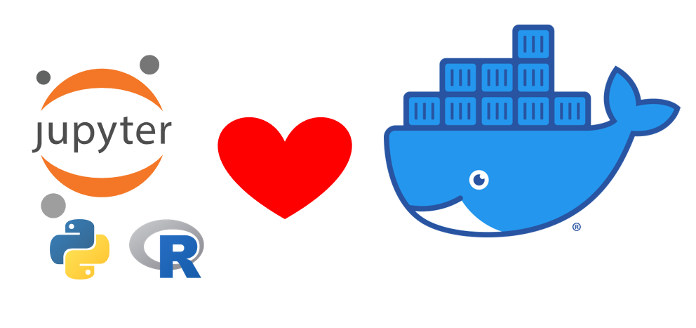

# Python For Data - Training

Este repositório tem por objetivo trazer uma visão geral sobre o curso <b>[Python para Dados - Alura](https://cursos.alura.com.br/course/python-data-science-primeiros-passos)</b> em um nível báscio, ofertado pela Alura.<br />

Esta formação possui 5 módulos conforme a estrutura definida a seguir:

- Módulo 1 - Começando com Python
    1. Desafio 1[^1].
- Módulo 2 - Manipulando Dados com Python
    1. Desafio 2[^].
- MÓDULO 3. Estruturas Condicionais
    1. Desafio 3[^1].
- MÓDULO 4. Estruturas de Repetição
    1. Desafio 4[^1].
- MÓDULO 5. Estrutura de Dados
    1. Desafio 5[^1].

[^1]: Desafio do módulo pré-requisito para conclusão do curso e emissão de certificado.

A criação deste repositório, considerei trazer uma solução para pessoas que tenham dificultado com instalação de programas, e ou, não possuam um computador com capacidade para executar vários programas ao mesmo tempo. Pensando neste cenário, dentro da estrutura do repositório criei um arquivo chamado ==docker-compose.yaml==.

### Introdução para executar o arquivo yaml
- ❌ Não faça o download do projeto    ✅ Faça o fork utilizando a forma https ou ssh.
- Customize o tempo e desenvolvimento usando WSL2 com Docker Engine - [Tutorial](https://github.com/vitorkol/wsl2-without-docker-desktop).
- Se não usar o WSL2, você pode instalar o programa docker - *[docker](https://www.docker.com)*.
- Use o editor de texto de sua preferência Gitbash or VScode para clonar o repositório via fork.
- Navegue até a pasta raiz do projeto.
- Renomeie a pasta env-template para env e configure as suas variáveis.
- Execute o compando ```docker compose up -d```.
- Executado o arquivo e criado o container no docker em seu naegador da web digite: <localhost:8080>.
- Pronto, agora você tem o python rodando com Conda, Julia e Jupyter Notebook rodando em sua máquina pelo browser.

